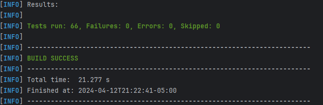
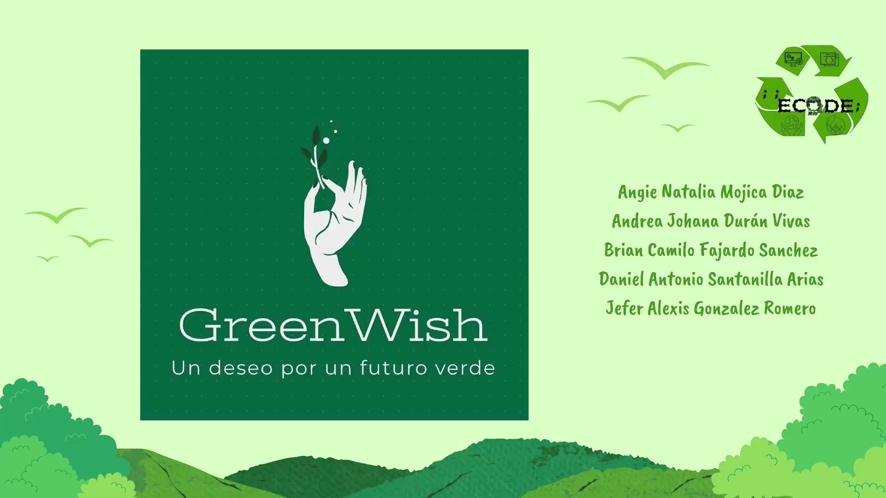
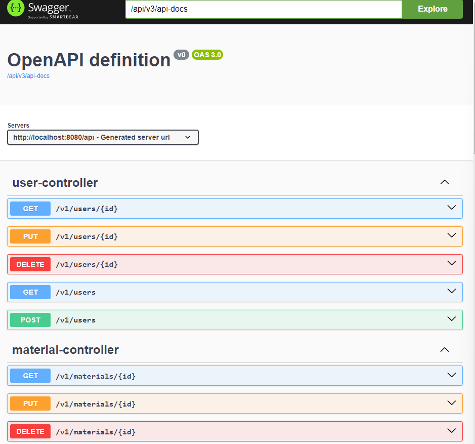

# GreenWish Backend

Este repositorio es el backend para la iniciativa de negocio GreenWish, una plataforma que conecta a ciudadanos con empresas de reciclaje y puntos de recolección en Bogotá.
La plataforma incluye una página web y una aplicación móvil, ofreciendo a los usuarios la posibilidad de encontrar puntos de recolección cercanos, recibir información y consejos sobre reciclaje,
y ganar puntos por reciclar. Los puntos acumulados pueden canjearse por beneficios como descuentos en comercios locales, entradas a eventos o donaciones a causas ambientales.


## Comenzando 🚀

Estas instrucciones te permitirán obtener una copia del proyecto en funcionamiento en tu máquina local para propósitos de desarrollo y pruebas.

Mira **Despliegue** para conocer como desplegar el proyecto.


### Pre-requisitos 📋

- [Git](https://www.youtube.com/watch?v=4xqVv2lTo40/) - Control de versiones
- [Maven](https://www.youtube.com/watch?v=1QfiyR_PWxU) - Gestor de dependencias
- [Java 17](https://www.youtube.com/watch?v=BG2OSaxWX4E) - Lenguaje de programación
- [Docker](https://www.youtube.com/watch?v=ZO4KWQfUBBc) - Motor de contenedores
- [Docker Compose](https://www.youtube.com/watch?v=Qw9zlE3t8Ko) - Herramienta para definir y ejecutar aplicaciones Docker de múltiples contenedores

### Instalación 🔧

Para hacer una copia local del proyecto, debemos abrir nuestra terminal, dirigirnos al directorio donde estará el proyecto y usar el siguiente comando:
```
git clone https://github.com/ieti-ecode/greenwish-backend.git
```

Nos dirigimos al directorio creado con

```
cd greenwish-backend
```

### Ejecutando la aplicación

Para ejecutar la aplicación, primero debemos compilar el proyecto con el siguiente comando
`mvn clean install`
. Esto nos permitirá limpiar las construcciones previas de otras versiones y luego compilará el proyecto.

Y ejecutamos el siguiente comando para crear 2 contenedores. Uno será la instancia de la base de datos y el otro el de la
aplicación que tendrá todos nuestros endpoints.

```bash
docker-compose up -d
```
En el video de **Despliegue** podemos ver los distintos endpoints creados, la aplicación se estará ejecutando en el puerto 8080.

## Arquitectura 🏗️

Las principales entidades del proyecto son:

* **User:** Representa a los ciudadanos que utilizan la plataforma para interactuar con las empresas de reciclaje y puntos de recolección.
* **Company:** Representa a las empresas de reciclaje y puntos de recolección que ofrecen sus servicios a través de la plataforma.
* **Benefit:** Representa los beneficios que los usuarios pueden canjear por los puntos acumulados.
* **Material:** Representa los diferentes tipos de materiales que los usuarios pueden reciclar.


El proyecto utiliza JWT (JSON Web Tokens) para la autenticación, asegurando que las comunicaciones entre el cliente y el servidor sean seguras y autenticadas.
Los JWT son generados en el backend y enviados al frontend, permitiendo el acceso a rutas protegidas de la API. La generación y verificación de los tokens JWT se manejan
mediante funciones específicas, garantizando la integridad y seguridad de las transacciones.

Adicionalmente, se hace uso de una base de datos de MongoDB, que almacena la información de los usuarios, empresas, beneficios y materiales.

Este repositorio incluye pruebas para cada uno de los servicios principales, asegurando que todas las funcionalidades clave, como la gestión de usuarios,
compañías, beneficios y materiales, funcionen correctamente. Además, se implementan mecanismos de seguridad para proteger las rutas de la API y garantizar la privacidad
y seguridad de los datos de los usuarios.


## Ejecutando las pruebas ⚙️

Se realizaron pruebas unitarias y pruebas de integración.
Las pruebas unitarias se pueden correr con el comando `mvn test`.

El resultado de la ejecución debe ser el siguiente:



Las pruebas de integración se pueden ver en el video que se encuentra en la sección de **Despliegue**.

### Análisis de las pruebas 🔩

#### Pruebas de Autenticación

- `login()`: Verifica el flujo de inicio de sesión.

#### Pruebas de la Entidad Benefit

1.  **Funcionalidad del Controlador**

- `testFindAllBenefits()`: Recuperación de todos los beneficios.
- `testFindByIdExistingBenefit()`: Recuperación de un beneficio por ID.
- `testFindByIdNotExistingBenefit()`: Comportamiento al intentar recuperar un beneficio inexistente.
- `testSaveNewBenefit()`: Creación de un nuevo beneficio.
- `testUpdateExistingBenefit()`: Actualización de un beneficio existente.
- `testUpdateNotExistingBenefit()`: Comportamiento al intentar actualizar un beneficio inexistente.
- `testDeleteExistingBenefit()`: Eliminación de un beneficio existente.
- `testDeleteNotExistingBenefit()`: Comportamiento al intentar eliminar un beneficio inexistente.

2. **Funcionalidad de los Servicios**

- `testFindAllBenefits()`: Recuperación de todos los beneficios.
- `testFindByIdExistingBenefit()`: Recuperación de un beneficio por ID.
- `testFindByIdNotFound()`: Comportamiento al intentar recuperar un beneficio inexistente.
- `testSaveNewBenefit()`: Creación de un nuevo beneficio.
- `testUpdateExistingBenefit()`: Actualización de un beneficio existente.
- `testUpdateNotExistingBenefit()`: Comportamiento al intentar actualizar un beneficio inexistente.
- `testDeleteExistingBenefit()`: Eliminación de un beneficio existente.
- `testDeleteNotExistingBenefit()`: Comportamiento al intentar eliminar un beneficio inexistente.

#### Pruebas de la Entidad Company

1. **Funcionalidad del Controlador**

- `testFindAllBenefits()`: Recuperación de todas las compañías.
- `testFindByIdExistingCompany()`: Recuperación de una compañía por ID.
- `testFindByIdNotExistingBenefit()`: Comportamiento al intentar recuperar una compañía inexistente.
- `testSaveNewCompany()`: Creación de una nueva compañía.
- `testUpdateExistingCompany()`: Actualización de una compañía existente.
- `testUpdateNotExistingCompany()`: Comportamiento al intentar actualizar una compañía inexistente.
- `testDeleteExistingCompany()`: Eliminación de una compañía existente.
- `testDeleteNotExistingCompany()`: Comportamiento al intentar eliminar una compañía inexistente.

2. **Funcionalidad de los Servicios**

- `testFindAllCompanies()`: Recuperación de todas las compañías.
- `testFindByIdExistingCompany()`: Recuperación de una compañía por ID.
- `testFindByIdNotFound()`: Comportamiento al intentar recuperar una compañía inexistente.
- `testSaveNewCompany()`: Creación de una nueva compañía.
- `testUpdateExistingBenefit()`: Actualización de una compañía existente.
- `testUpdateNotExistingBenefit()`: Comportamiento al intentar actualizar una compañía inexistente.
- `testDeleteExistingBenefit()`: Eliminación de una compañía existente.
- `testDeleteNotExistingBenefit()`: Comportamiento al intentar eliminar una compañía inexistente.

#### Pruebas de la Entidad Material

1. **Funcionalidad del Controlador**

- `testFindAllMaterials()`: Recuperación de todos los materiales.
- `testFindByIdExistingMaterial()`: Recuperación de un material por ID.
- `testFindByIdNotExistingMaterial()`: Comportamiento al intentar recuperar un material inexistente.
- `testSaveNewMaterial()`: Creación de un nuevo material.
- `testUpdateExistingMaterial()`: Actualización de un material existente.
- `testUpdateNotExistingMaterial()`: Comportamiento al intentar actualizar un material inexistente.
- `testDeleteExistingCompany()`: Eliminación de un material existente.
- `testDeleteNotExistingCompany()`: Comportamiento al intentar eliminar un material inexistente.

2. **Funcionalidad de los Servicios**

- `testFindAllMaterials()`: Recuperación de todos los materiales.
- `testFindByIdExistingMaterial()`: Recuperación de un material por ID.
- `testFindByIdNotFound()`: Comportamiento al intentar recuperar un material inexistente.
- `testSaveNewMaterial()`: Creación de un nuevo material.
- `testUpdateExistingMaterial()`: Actualización de un material existente.
- `testUpdateNotExistingMaterial()`: Comportamiento al intentar actualizar un material inexistente.
- `testDeleteExistingMaterial()`: Eliminación de un material existente.
- `testDeleteNotExistingMaterial()`: Comportamiento al intentar eliminar un material inexistente.

#### Pruebas de la Entidad User

1.  **Funcionalidad del Controlador**

- `testFindAllUsers()`: Recuperación de todos los usuarios.
- `testFindByIdExistingUser()`: Recuperación de un usuario por ID.
- `testFindByIdNotExistingBenefit()`: Comportamiento al intentar recuperar un usuario inexistente.
- `testSaveNewUser()`: Creación de un nuevo usuario.
- `testUpdateExistingUser()`: Actualización de un usuario existente.
- `testUpdateNotExistingCompany()`: Comportamiento al intentar actualizar un usuario inexistente.
- `testDeleteExistingCompany()`: Eliminación de un usuario existente.
- `testDeleteNotExistingCompany()`: Comportamiento al intentar eliminar un usuario inexistente.

2. **Funcionalidad de los Servicios**

- `testFindAllUsers()`: Recuperación de todos los usuarios.
- `testFindByIdExistingUser()`: Recuperación de un usuario por ID.
- `testFindByIdNotFound()`: Comportamiento al intentar recuperar un usuario inexistente.
- `testSaveNewUser()`: Creación de un nuevo usuario.
- `testUpdateExistingUser()`: Actualización de un usuario existente.
- `testUpdateNotExistingUser()`: Comportamiento al intentar actualizar un usuario inexistente.
- `testDeleteExistingUser()`: Eliminación de un usuario existente.
- `testDeleteNotExistingUser()`: Comportamiento al intentar eliminar un usuario inexistente.

## Despliegue 📦

Para el despliegue de la aplicación, usamos máquinas virtuales de AWS. En estas máquinas, se instala Docker y Docker Compose.
Y se repiten los pasos de instalación y ejecución de la aplicación. En el siguiente video, podemos ver el uso de la aplicación en la nube.

[](https://drive.google.com/file/d/1bwJ2kyJ_BsPG0bVvyGRBbByhHOYLq3aK/view)

## Construido con 🛠️

* [Java](https://www.java.com/es/) - Lenguaje de programación
* [Maven](https://maven.apache.org/) - Manejador de dependencias
* [SpringBoot](https://www.docker.com/) - Herramienta para aplicaciones web
* [Docker](https://www.docker.com/) - Software de contenedores

## Documentación 📖

Para visualizar la documentación del proyecto solo debes correr el siguiente comando desde el directorio raiz del proyecto

```bash
mvn javadoc:javadoc
```

Y en la siguiente ruta encontrarás el archivo index.html en donde si lo abres desde el navegador podras ver toda la documentación

```
./target/site/apidocs
```

Deberías ver algo como esto:


Adicionalmente, puedes ver la documentación de los endpoints en el siguiente enlace, en caso de que
la instalación sea local, si no, se cambia el localhost por la dirección del servidor donde se encuentre desplegado el proyecto:
http://localhost:8080/api/swagger-ui.html


Deberías ver algo como esto:



## Versionado 📌


## Autores ✒️

* **Angie Natalia Mojica Diaz** - [An6ie02](https://github.com/An6ie02)
* **Daniel Antonio Santanilla Arias** - [ELS4NTA](https://github.com/ELS4NTA)
* **Jefer Alexis Gonzalez Romero** - [AlexisGR117](https://github.com/AlexisGR117)
* **Brian Camilo Fajardo Sanchez** - [briancfajardo](https://github.com/briancfajardo)
* **Andrea Johana Durán Vivas** - [andreaduranvivas](https://github.com/andreaduranvivas)

## Licencia 📄

Este proyecto está bajo la Licencia CC0 - mira el archivo [LICENSE](LICENSE) para detalles

## Agradecimientos 🎁

* A nuestro maravilloso equipo de trabajo
* Ada School

